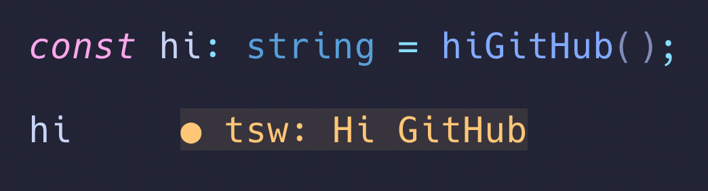

<h1 align="center">Tsw - Live Results In Neovim</h1>
<div align="center">

</div>
<div align="center">

</div>

## Installation

Copy the `ts-worksheet.lua` and the `ts-worksheet-cli.js` files into the location your nvim installation looks up
plugins. It's only important that both files are in the same directory.
If you want to use `bun` or `deno` to run your code, the binaries have to be available from a terminal. (Check
with `which bun` or or `which deno` if they are available)

## Setup

You don't need any setup to start using it. So just require it:

```lua
require('ts-worksheet')
```

If you want to change the diagnostics color of the output, you can use a setup like this:

```lua
require('ts-worksheet').setup({
    type = vim.diagnostic.severity.WARN
})
```

### Using [Lazy.nvim](https://github.com/folke/lazy.nvim)

Add the following to your Neovim configuration:

```lua
    {
        "typed-rocks/ts-worksheet-neovim",
        opts = {
            severity = vim.diagnostic.severity.WARN,
        },
        config = function(_, opts)
            require("tsw").setup(opts)
        end
    },

```

## How To Use Other Runtimes

Just make sure to have `bun` or `deno` available in your systems `PATH`.

## Usage

Just call `:Tsw` in a `js` or `ts` file to run the worksheet.
By default it uses `node` as runtime and does not show the results of variables.

### All options

`Tsw rt=[bun|node|deno] show_variables=[true|false] show_order=[true|false]`

### Defaults:

`Tsw rt=node show_variables=false show_order=false`

